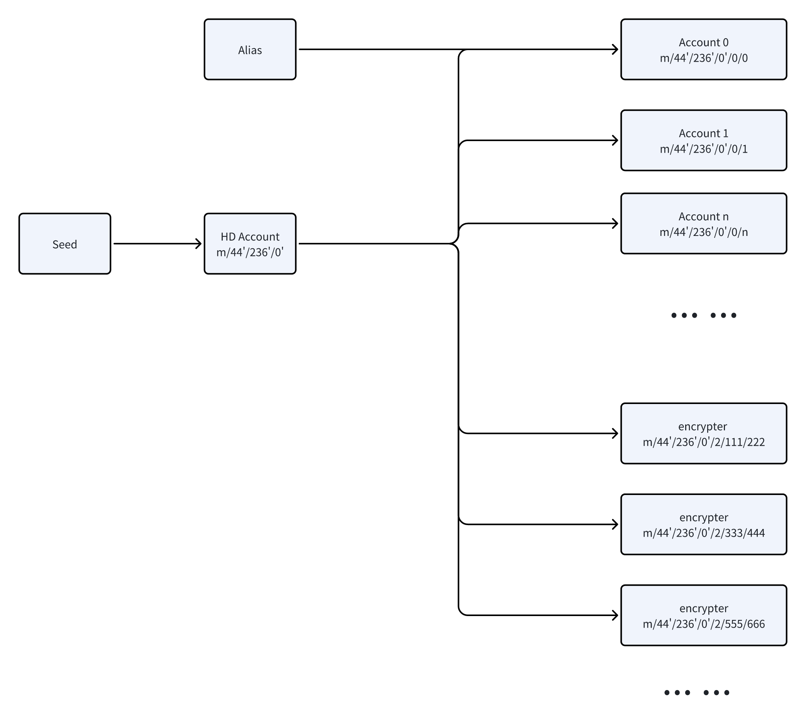
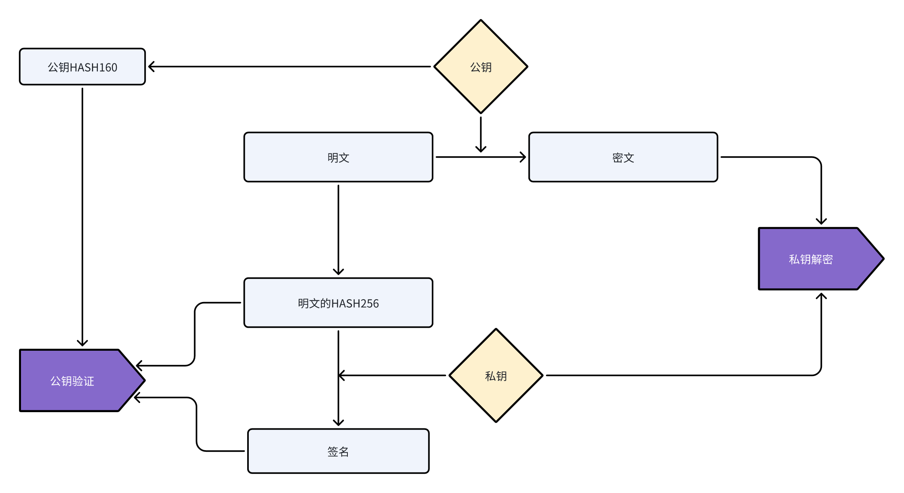

# NOTE协议用户白皮书(draft)

>株式会社ChainBow和作者李龙保留所有权利。对于本文件中可能出现的任何错误或不准确之处，我们不承担任何责任。


## 1. 简介

NOTE协议使基于比特币UTXO模型的区块链能够创建及管理数字资产。该协议支持强加密数据存储与通信，亦适用于公开透明的数据存储，包括Token与NFT等数字资产的所有权管理。

本协议基于BIP32标准，确定去中心化身份（DID）的生成规则。

针对加密数据，本协议采用DID规则，对每条记录以难以预测的随机公私钥加密解密，并使用Electrum BIE1 ECIES算法进行数据加密。

协议明确数据存储格式，并定义了数据的增删改查及分享规则。

信息安全无须依赖第三方信任，仅助记词持有者可访问数据，确保数据安全与存储安全。

利用链上智能合约进行比特币共识级别的资产校验，结合链下资产索引器，高效解读链上资产并提供资产的默克尔证明。

此为一种第二层解决方案，基于牢不可破的比特币协议及其底层区块链共识规则。本协议也为Layer 2网络奠定应用基础需求。


## 2. 协议解决的问题和方案
基于UTXO模型的区块链特点，本协议解决以下问题：
- 去中心化身份（DID）
- 数据格式
- 数据存储位置
- 数据所有权确认
- 所有权转移
- 链上合约
- 数据解析
- 数据索引
- 资产创建
- 资产挖掘
- 资产转移
- 资产销毁
- 资产通知
- 资产证明

设计过程中考虑了交易顺序，以避免双重支付、减少链上数据冗余，以及防止资产误消耗等问题。

### 2.2 去中心化ID
在用户的终端设备（如手机或电脑）上，基于BIP32协议派生账户公私钥和用于数据加密的私钥。这些私钥作为去中心化身份标识，使用公开的账户公钥来标识用户。在所有权确认、签名、数据创建和分享等所有场景中均使用此身份。



#### 2.2.1 账号密钥
账号密钥基于以下路径派生：

`m/purpose'/coin_type'/account'/target/index`

在NOTE.SV软件中使用了下面的变量
```
purpose = 44
coin_type=236
account=0
target=0
index=0
```
完整的派生路径为：

`m/44'/236'/0'/0/0`

顺序增加index可以创建多账号。

#### 2.2.2 数据加密密钥的派生
数据加密密钥的派生路径定义如下：

`m/purpose'/coin_type'/account'/target/quotient/remainder`

在NOTE.SV软件中，使用了以下变量：
```
purpose = 44
coin_type = 236
account = 0
target = 2
```

派生路径的生成步骤如下：
1. 随机生成一个64位整数 n。
2. 遵循IEEE754标准，对随机数取模 `n % (2^53-2) + 1`，生成派生索引。
3. 使用派生索引除以Hardened，获取商和余数。代码如下：
   ```typescript
   const Hardened = 0x80000000;
   const quotient = Math.floor(index / Hardened);
   const remainder = index % Hardened;
   ```
完整的派生路径为：

`m/44'/236'/0'/2/${quotient}/${remainder}`

### 2.3 数据的格式和顺序
链上数据的格式和顺序规定如下：
- 公钥HASH：持有者的账号公钥的HASH160。
- 明文HASH：
  - 如果是加密信息，则为明文的SHA256值。
  - 如果是公开数据，则为0x00。
- 数据：明文或密文。数据可为加密或公开数据。原始数据使用msgpack协议编码，需排序键值（sortKeys=true）。
- 签名：使用持有者账号私钥对明文HASH进行的签名。签名可通过持有者账号公钥验证。签名算法采用Bitcoin Message标准。如果可以提供交易的公钥签名，此处为0x00；否则必须有签名。
- 附加信息：描述数据的表现形式
  - 1字节的整数0x00，表示数据使用了持有者的账号公钥加密。
  - 1字节的整数0xff，表示数据未加密。
  - 8字节的整数，范围：1～2^53 - 1，表示数据使用了数据加密公钥加密。
- NOTE：全大写，固定的协议标识符。




### 2.4 存储位置
数据需放置在交易的解锁脚本中。在解锁过程中，矿工将对交易签名和其他解锁条件进行校验。同时，输出部分也需要有相应的脚本输出，以形成交易链条。索引器会根据区块和UTXO交易链确定交易的执行顺序，并据此验证资产交易的有效性。此类解锁签名的flag设置为 SINGLE | ANYONECANPAY。
本协议采用非标准脚本，与P2PKH等标准脚本不同，从而避免UTXO被误消费的情况。
本协议所使用的最简单比特币脚本示例如下。

#### 2.4.1 非标脚本
非标脚本按照以下格式定义：

```
解锁脚本：交易签名 公钥HASH 明文数据Hash 数据 数据签名 附加信息 
锁定脚本：NOTE OP_2DROP OP_2DROP OP_2DROP 原公钥 OP_CHECKSIG
交易输出：NOTE OP_2DROP OP_2DROP OP_2DROP 新公钥 OP_CHECKSIG
```

#### 2.4.2 使用P2WSH
在支持P2WSH的区块链中，格式定义如下：
```
解锁脚本：交易签名 公钥HASH 明文数据Hash 数据 数据签名 附加信息 
锁定脚本：NOTE OP_2DROP OP_2DROP OP_2DROP 原公钥 OP_CHECKSIG
输出脚本：NOTE OP_2DROP OP_2DROP OP_2DROP 新公钥 OP_CHECKSIG
脚本地址：赎回脚本的HASH地址
```
数据信息被保存在隔离见证数据区中。

#### 2.4.3 使用P2TR
类似于P2WSH，赎回脚本作为MAST的一个解锁分支。由包含数据解锁脚本提供解锁。
在支持P2TR的区块链中，格式定义如下：

```
解锁脚本：交易签名 公钥HASH 明文数据Hash 数据 数据签名 附加信息 
锁定分支脚本：NOTE OP_2DROP OP_2DROP OP_2DROP 公钥 OP_CHECKSIG
输出分支脚本：NOTE OP_2DROP OP_2DROP OP_2DROP 公钥 OP_CHECKSIG
交易输出：Taproot地址输出
```
解锁脚本信息保存在隔离见证数据区中。

> 建议使用非标脚本和P2WSH以获取更清晰的语义。P2TR MAST可实现更复杂的交易逻辑，但可能导致索引器设计更为复杂。

### 2.5 链上合约
通过更复杂的锁定脚本，可以创建链上智能合约，使得只有符合合约条件的交易才能被确认上链。以下是一个简单示例：该脚本要求，除了签名外，还必须提供特定的消息（message），才能发起交易并使信息成功上链。

```typescript
class Scryptdemo extends SmartContract {
    @prop()
    static note: ByteString = toByteString('NOTE', true)

    @prop()
    pubKey: PubKey

    @prop()
    hash: ByteString

    constructor(hash: Sha256) {
        super(...arguments)
        this.hash = hash
    }

    @method()
    public unlock(
        sig: Sig, 
        message: ByteString,
        owner: ByteString,
        plainHash: ByteString,
        data: ByteString,
        hashSig: ByteString,
        extra: bigint
    ) {
        Scryptdemo.note
        // owner
        // plainHash
        // data
        // hashSig
        // extra
        assert(sha256(message) == this.hash, 'Hash does not match')
        assert(this.checkSig(sig, this.pubKey), 'signature check failed')
    }
}
```

编译后的脚本为
```typescript
4e4f5445 <hash> 0 0 OP_NOP OP_DROP OP_NOP OP_2 OP_PICK OP_DROP OP_8 OP_PICK OP_SHA256 OP_1 OP_PICK OP_EQUAL OP_VERIFY OP_9 OP_PICK OP_2 OP_PICK OP_CHECKSIG OP_NIP OP_NIP OP_NIP OP_NIP OP_NIP OP_NIP OP_NIP OP_NIP OP_NIP OP_NIP
```

> 示例合约使用[Scrypt](Scrypt.io)制作。

无论是最简单的合约还是更复杂的合约，在由解锁脚本和锁定脚本构成的交易脚本中，数据的格式和顺序都必须遵循本协议的规定。由于支持智能合约，链上Oracle和Swap等功能也将成为可能。

### 2.6 数据所有权确认
数据上链必须通过花费符合本协议规定的UTXO来完成交易签名或数据签名。链上矿工以及链下索引和钱包通过检查签名来确认数据所有权。UTXO链保证交易顺序，防止双重支付。数据签名和交易签名的二选一机制允许第三方代付交易费用。如果未提供数据签名，则交易签名者被视为数据的持有者。
数据所有权可通过以下步骤确认：
1. 如果存在数据签名，首先检查持有者的数据签名，提取公钥，并与持有者的公钥HASH一起验证。如果验证通过，则所有权归公钥持有者。如果验证不通过，则该交易为非法交易。
2. 如果未提供数据签名，则提供交易解锁的公钥即为数据所有者。

### 2.7 所有权的转移

#### 2.7.1 提供数据签名时
1. 获取接收方的公钥。
2. 计算接收方公钥的HASH。
3. 使用发送方的账户私钥进行签名。
4. 代付方或发送方使用私钥签名交易。

#### 2.7.2 未提供数据签名时
1. 获取接收方的公钥。
2. 将交易输出到对方的公钥脚本或公钥脚本的HASH。
3. 将接收方的HASH数据设置为0x00，以节约交易空间。
4. 发送方使用私钥签署交易。

### 2.8 数据解析
交易发布到区块链后，数据索引器对交易进行解析，检查签名以确认所有权是否符合协议，并解析数据内容以确定其有效性。不符合规定的交易将被丢弃。大量的非合规交易可通过垃圾邮件过滤器标记发起方。

## 3. 加密数据
### 3.1 数据的创建
加密数据的创建过程如下：
1. 准备明文数据内容。
2. 使用msgpack对数据进行打包。
3. 获取打包数据的SHA256 HASH。
4. 生成随机数，创建派生索引，并根据索引派生出加密私钥。
5. 使用派生出的公钥对数据进行加密。
6. 使用账户私钥对加密后的数据进行Bitcoin Message签名。
7. 构建数据脚本。
8. 构造交易并广播。

### 3.2 数据签名加密数据的分享
加密数据转让时的步骤：
1. 转让加密数据时，设置附加数据为0。
2. 获取交易对方的公钥。
3. 使用对方公钥加密数据。
4. 使用自己的根私钥进行签名。由于从签名中可以提取出公钥，因此可以确认自身身份。
5. 设置交易对方的公钥HASH。
6. 接收方在解密数据后可以验证明文的Hash256。

`接收方公钥HASH 明文Hash 加密数据 持有者的数据签名 00 NOTE`


## 4. NFT
由于比特币区块链的愿景和技术限制，本协议不要求也不建议将大量数据存储在区块链上。只需将数据的HASH上链，数据本身可以存储在其他去中心化或中心化系统中。

## 5. Token
TODO

## 6. 数据索引
TODO

## 6.1 资产证明
TODO


## 7. 参考
感谢以下列出及未列出的所有个人和团队对比特币的贡献，他们的文章和代码给予了我们极大的启发。

### 比特币
[白皮书](https://bitcoin.org/bitcoin.pdf) - 牢不可破的比特币协议。

### BIP32
[BIP32](https://github.com/bitcoin/bips/blob/master/bip-0032.mediawiki) 定义了一套通过助记词派生私钥的算法，可用于获取相应的公钥和公钥哈希（即地址）。

### Electrum BIE1 ECIES
[Electrum BIE1 ECIES](https://github.com/benw46/BIE1) 定义了使用椭圆曲线算法进行数据加密和解密的方法。

### Paymail
[Paymail](https://bsvalias.org/) 启发了我们的DID设计。

### Ordinals
[Ordinals](https://docs.ordinals.com/) 促使我们升级协议。

### BRC-20
[BRC-20](https://domo-2.gitbook.io/brc-20-experiment/) 对标准数据格式提出了建议。

### Atomicals
[Atomicals](https://docs.atomicals.xyz/) 帮助我们更好地理解需求。

### Scrypt
[Scrypt](Scrypt.io) 带来比特币智能合约


