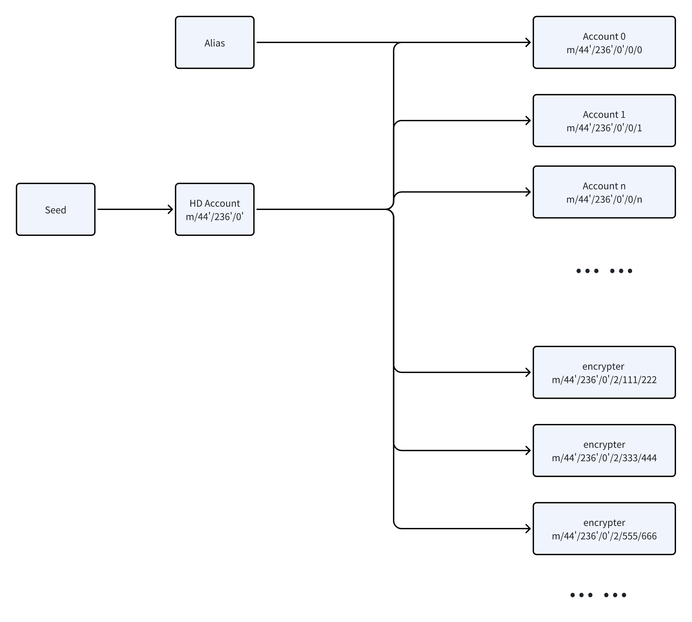

# NOTE Protocol(draft)

## 1. Introduction

The NOTE protocol enables blockchain systems based on the Bitcoin UTXO model to create and manage digital assets. This protocol supports secure encrypted data storage and communication, and is also applicable to public and transparent data storage, including the management of ownership rights for digital assets such as Tokens and NFTs.

This protocol is grounded in the BIP32 standard to determine the generation rules for Decentralized Identities (DID).

For encrypted data, the protocol employs DID rules. Each record is encrypted and decrypted with unpredictable random public and private keys, using the Electrum BIE1 ECIES algorithm for data encryption.

The protocol specifies the data storage format and defines the rules for data creation, deletion, modification, retrieval, and sharing.

Information security does not rely on third-party trust; only the holders of mnemonic phrases can access the data, ensuring both data and storage security.

Utilizing on-chain smart contracts for Bitcoin consensus-level asset verification, combined with off-chain asset indexers, the protocol efficiently interprets on-chain assets and provides Merkle proofs for these assets.

This is a second-layer solution built upon the unshakeable Bitcoin protocol and its underlying blockchain consensus rules. The protocol also lays the foundational application requirements for Layer 2 networks.

## 2. Problems Solved and Solutions by the Protocol
Based on the characteristics of blockchains using the UTXO model, this protocol addresses the following issues:
- Decentralized Identity (DID)
- Data Format
- Data Storage Location
- Confirmation of Data Ownership
- Transfer of Ownership
- On-chain Contracts
- Data Parsing
- Data Indexing
- Asset Creation
- Asset Mining
- Asset Transfer
- Asset Destruction
- Asset Notification
- Asset Proof

During the design process, considerations were made for transaction sequencing to prevent double spending, reduce data redundancy on the blockchain, and avoid accidental asset consumption.

### 2.1 System Relationship Diagram
As shown in the diagram below, asset private keys are generated and stored in user wallets or related software. Once data asset transactions are broadcasted to the blockchain, the blockchain ensures transparency of information and its irreversibility, clearly defining the timing and sequence of transactions, and verifying ownership signatures through on-chain smart contracts. Data indexers and validators are responsible for interpreting transaction data, executing off-chain smart contracts, and providing Merkle proofs of assets. Data indexers will evolve into a Layer 2 network with a consensus mechanism.


### 2.2 Decentralized ID
On users' end devices (such as mobile phones or computers), account public and private keys, along with private keys for data encryption, are derived based on the BIP32 protocol. Serving as decentralized identities, these keys utilize the publicly accessible account public key for user identification. This identity is used in all scenarios including ownership confirmation, signing, data creation, and sharing.




#### 2.2.1 Account Keys
Account keys are derived following this path:


`m/purpose'/coin_type'/account'/target/index`

In the NOTE.SV software, the following variables are used:

```
purpose = 44
coin_type=236
account=0
target=0
index=0
```
Thus, the complete derivation path is:

`m/44'/236'/0'/0/0`

By sequentially increasing the index, multiple accounts can be created.

#### 2.2.2 Derivation of Data Encryption Keys
The derivation path for data encryption keys is defined as follows:

`m/purpose'/coin_type'/account'/target/quotient/remainder`

In the NOTE.SV software, the following variables are used:
```
purpose = 44
coin_type = 236
account = 0
target = 2
```

The steps for generating the derivation path are as follows:
1. Randomly generate a 64-bit integer n.
2. Following the IEEE754 standard, modulate the random number `n % (2^53-2) + 1` to generate the derivation index.
3. Divide the derivation index by Hardened to obtain the quotient and remainder. The code is as follows:
   ```typescript
   const Hardened = 0x80000000;
   const quotient = Math.floor(index / Hardened);
   const remainder = index % Hardened;
   ```
The complete derivation path is:

`m/44'/236'/0'/2/${quotient}/${remainder}`

### 2.3 Data Format and Order
The format and order of data on the blockchain are stipulated as follows:
- Public Key HASH: The HASH160 of the holder's account public key.
- Plaintext HASH:
  - If it is encrypted information, then it is the SHA256 value of the plaintext.
  - If it is public data, then it is 0x00.
- Data: Plaintext or ciphertext. Data can be either encrypted or public. Original data should be encoded using the msgpack protocol with sorted keys (sortKeys=true).
- Signature: A signature made using the holder's account private key on the plaintext HASH. This signature can be verified using the holder's account public key. The signature algorithm uses the Bitcoin Message standard. If a public key signature for the transaction can be provided, this field is 0x00; otherwise, a signature is required.
- Additional Information: Describes the data representation form
  - A 1-byte integer 0x00, indicating the data is encrypted using the holder's account public key.
  - A 1-byte integer 0xff, indicating the data is unencrypted.
  - An 8-byte integer, range: 1 to 2^53 - 1, indicating the data is encrypted using the data encryption public key.
- NOTE: All uppercase, fixed protocol identifier.


### 2.4 Storage Location
Data is required to be placed in the unlocking script of a transaction. During the unlocking process, miners verify the transaction signature and other unlocking conditions. At the same time, it is required that the output section includes a corresponding script output to form a transaction chain. Indexers will determine the execution order of transactions based on the block and UTXO transaction chain, thereby verifying the validity of asset transactions. The unlocking signature flag for this type of transaction is set to SINGLE | ANYONECANPAY.
This protocol uses non-standard scripts, which, unlike standard scripts such as P2PKH, prevent the accidental consumption of UTXOs.
An example of the simplest Bitcoin script used in this protocol is as follows.

#### 2.4.1 Non-standard Scripts
Non-standard scripts are defined in the following format:

```
Unlocking Script: Transaction Signature, Public Key HASH, Plaintext Data Hash, Data, Data Signature, Additional Information.
Locking Script: NOTE, OP_2DROP, OP_2DROP, OP_2DROP, Original Public Key, OP_CHECKSIG.
Transaction Output: NOTE, OP_2DROP, OP_2DROP, OP_2DROP, New Public Key, OP_CHECKSIG.

```

#### 2.4.2 Using P2WSH
In blockchains supporting P2WSH, the format is defined as follows:

```
Unlocking Script: Transaction Signature, Public Key HASH, Plaintext Data Hash, Data, Data Signature, Additional Information.
Locking Script: NOTE, OP_2DROP, OP_2DROP, OP_2DROP, Original Public Key, OP_CHECKSIG.
Output Script: NOTE, OP_2DROP, OP_2DROP, OP_2DROP, New Public Key, OP_CHECKSIG.
Script Address: HASH address of the redemption script.
```
Data information is stored in the segregated witness data area.

#### 2.4.3 Using P2TR
Similar to P2WSH, the redemption script serves as an unlocking branch of MAST, unlocked by a script containing data unlocking instructions.
In blockchains supporting P2TR, the format is defined as follows:

```
Unlocking Script: Transaction Signature, Public Key HASH, Plaintext Data Hash, Data, Data Signature, Additional Information.
Locking Branch Script: NOTE, OP_2DROP, OP_2DROP, OP_2DROP, Public Key, OP_CHECKSIG.
Output Branch Script: NOTE, OP_2DROP, OP_2DROP, OP_2DROP, Public Key, OP_CHECKSIG.
Transaction Output: Taproot address output.
```
Unlocking script information is stored in the segregated witness data area.


  Using non-standard scripts and P2WSH is recommended for clearer semantics. P2TR MAST can provide more complex transaction logic but may lead to more complex indexer designs.

### 2.5 On-Chain Contracts
More complex locking scripts can be used to create on-chain smart contracts, ensuring that only transactions meeting the contract's conditions can be confirmed on the blockchain. Below is a simple example: This script requires that, in addition to a signature, a specific message must be provided in order to initiate a transaction and successfully record the information on the blockchain.


```typescript
class Scryptdemo extends SmartContract {
    @prop()
    static note: ByteString = toByteString('NOTE', true)

    @prop()
    pubKey: PubKey

    @prop()
    hash: ByteString

    constructor(hash: Sha256) {
        super(...arguments)
        this.hash = hash
    }

    @method()
    public unlock(
        sig: Sig, 
        message: ByteString,
        owner: ByteString,
        plainHash: ByteString,
        data: ByteString,
        hashSig: ByteString,
        extra: bigint
    ) {
        Scryptdemo.note
        // owner
        // plainHash
        // data
        // hashSig
        // extra
        assert(sha256(message) == this.hash, 'Hash does not match')
        assert(this.checkSig(sig, this.pubKey), 'signature check failed')
    }
}
```
The compiled script is
```typescript
4e4f5445 <hash> 0 0 OP_NOP OP_DROP OP_NOP OP_2 OP_PICK OP_DROP OP_8 OP_PICK OP_SHA256 OP_1 OP_PICK OP_EQUAL OP_VERIFY OP_9 OP_PICK OP_2 OP_PICK OP_CHECKSIG OP_NIP OP_NIP OP_NIP OP_NIP OP_NIP OP_NIP OP_NIP OP_NIP OP_NIP OP_NIP
```

> The example contract is created using Scrypt.io. 

Whether it's the simplest contract or more complex ones, in the transaction script formed by the unlocking and locking scripts, the format and order of data must comply with the regulations of this protocol. With support for smart contracts, functionalities like on-chain Oracles and Swaps will also become possible.


### 2.6 Data Ownership Confirmation
To record data on the blockchain, it must be done by spending a UTXO defined by this protocol and completing either a transaction signature or a data signature. On-chain miners and off-chain indexers and wallets confirm data ownership by checking the signature. The UTXO chain ensures the order of transactions, preventing double-spending. The option to choose between a data signature and a transaction signature allows third parties to pay transaction fees. If no data signature is provided, the signer of the transaction is considered the data owner.
Data ownership can be confirmed by the following steps:

1. If a data signature exists, first check the holder's data signature, extract the public key, and verify it together with the holder's public key HASH. If the verification passes, the ownership belongs to the public key holder. If not, the transaction is deemed illegal.

2. If no data signature is provided, the public key used to unlock the transaction is considered the data owner.

### 2.7 Transfer of Ownership
#### 2.7.1 When Providing a Data Signature
1. Obtain the recipient's public key.
2. Calculate the HASH of the recipient's public key.
3. Sign using the sender's account private key.
4. The payer or sender signs the transaction with their private key.

#### 2.7.2 When No Data Signature is Provided
1. Obtain the recipient's public key.
2. Direct the transaction output to the recipient's public key script or the HASH of the public key script.
3. Set the recipient's HASH data to 0x00 to save transaction space.
4. The sender signs the transaction using their private key.

### 2.8 Data Parsing
After a transaction is published to the blockchain, data indexers parse the transaction, checking the signatures to ensure ownership complies with the protocol, and analyzing the data content to determine its validity. Non-compliant transactions will be discarded. A large volume of non-compliant transactions can be flagged by spam filters.

## 3. Encrypted Data
### 3.1 Creation of Data
The creation of encrypted data follows these steps:
1. Prepare plaintext data content.
2. Package the data using msgpack.
3. Obtain the SHA256 HASH of the packaged data.
4. Generate a random number, create a derivation index, and derive an encryption private key based on the index.
5. Encrypt the data using the derived public key.
6. Sign the encrypted data using the account private key with a Bitcoin Message signature.
7. Construct the data script.
8. Construct and broadcast the transaction.

### 3.2 Sharing of Signed Encrypted Data
When transferring encrypted data, follow these steps:
1. Set the additional data to 0 when transferring encrypted data.
2. Obtain the public key of the counterparty.
3. Encrypt the data using the counterparty's public key.
4. Sign with your own root private key. Since the public key can be extracted from the signature, it confirms your identity.
5. Set the counterparty's public key HASH.
6. The recipient can verify the plaintext Hash256 after decrypting the data.

`Pubkeyhash PlaintextHash EncryptedData Signature 00 NOTE`

## 4. NFT
Due to the vision and technical limitations of the Bitcoin blockchain, this protocol does not require nor recommend storing a large amount of NFT data on the blockchain. It is sufficient to record only the HASH of the NFT data on the chain, with the actual data being stored in other decentralized or centralized systems.

## 5. Token
TODO

## 6. Data Indexing
TODO

### 6.1 Asset Proof
TODO

## 7. References
Special thanks to the following individuals and teams, listed and unlisted, for their contributions to Bitcoin. Their articles and code have provided us with much inspiration.

### Bitcoin

[White Paper](https://bitcoin.org/bitcoin.pdf) - The unshakeable Bitcoin protocol.

### BIP32

[BIP32](https://github.com/bitcoin/bips/blob/master/bip-0032.mediawiki) defines a set of algorithms for deriving private keys from mnemonic phrases. Through private keys, corresponding public keys and public key hashes (i.e., addresses) can be obtained.

### Electrum BIE1 ECIES

[Electrum BIE1 ECIES](https://github.com/benw46/BIE1) defines how to encrypt and decrypt data using elliptic curve algorithms.

### Paymail
[Paymail](https://bsvalias.org/) inspired the design of DID.

### Ordinals
[Ordinals](https://docs.ordinals.com/) prompted us to upgrade the protocol.

### BRC-20
[BRC-20](https://domo-2.gitbook.io/brc-20-experiment/) suggestions for standard data formats.

### Atomicals
[Atomicals](https://docs.atomicals.xyz/) helped us better understand the requirements.

### Scrypt
[Scrypt](Scrypt.io) Smart Contract for Bitcoin


>ChainBow Co. Ltd. and author Long LI retain all rights. No liability is assumed for any errors or inaccuracies that may appear in this document.

